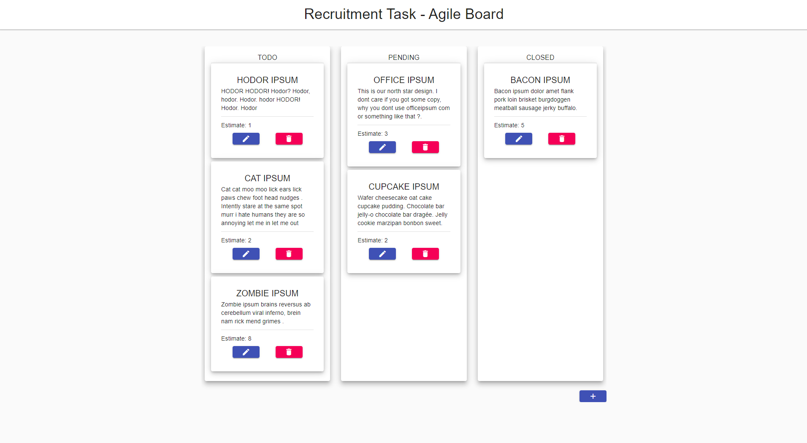

# Agile-Board-front



This is front for **Agile-Board** Recruitment task written using react.

Board allows you to **create** new issue, **edit** existing one or to **delete** them. You can change current state of issue by simply dragging them to another column.

I deployed this application to **github pages** https://poizxc.github.io/agile-board-front/, but I can't ensure that someone will not change the data I prepared - it is **publicly** available. Board should look like this in the screen above. You can reset the **database** to the state that I wanted it to be - all the details are in **[Notes For Reviewers](#notes-for-reviewers)**

This project was bootstrapped using **Create-React-App** old readme can be found in README.old.md

## Table Of Contents

- [Agile-Board-front](#agile-board-front)
  - [Table Of Contents](#table-of-contents)
  - [Prerequisites](#prerequisites)
  - [Installing](#installing)
  - [Running Application](#running-application)
  - [Running Tests](#running-tests)
  - **[Notes For Reviewers](#notes-for-reviewers)**
    - **[Tech Stack](#tech-stack)**
      - [Framework](#framework)
      - [State Management](#state-management)
      - [Type Checking](#type-checking)
      - [Styling](#styling)
      - [drag and drop](#drag-and-drop)

## Prerequisites

- **Node**
- **npm** / **yarn**

## Installing

To install **Agile-Board-front** use **Yarn** or **NPM**

```
npm install
```

```
yarn install
```

## Running Application

Before starting development server you may need to change proxy section in package.json, but it will be needed only if you changed default port of api.

To start development server type :

```
yarn start
```

or

```
npm run start
```

## Running Tests

To run tests you need to type :

```
yarn test
```

or

```
npm run test
```

## Notes For Reviewers

I implemented drag and drop in this application just to have possibility to change statuses, **reordering** of the list in one column is **not persistent**, I added this just to improve **UX** a little bit.

I added some styles to make this app more **responsive**, but I didn't spend much time on it, so it is not looking the best (but should be functional **enough**).

I hosted **Api** for this app on the free plan on **Heroku** so it may feel slow :/ cannot fight with it ;)

Because I cannot ensure that nobody will not change the data. I created one endpoint to **reset** DB. After resetting database you should **refresh** webpage otherwise you will be operating on **not** existing data.

```bash
curl --location --request DELETE 'https://agile-board1.herokuapp.com/api/v1/issues/_/reset-db'
```

### Tech Stack

#### Framework

I Decided to use **React** for this application, I was trying to follow the trends so i ended up with hooks based application. I didn't wrote any **webpack** config for this project, I simply used **create-react-app**.

#### State Management

I didn't used any state management libraries such as **redux** or **mobx** - I decided that it will overcomplicate things in such small app,

#### Type Checking

I didn't used any static type checking solutions such as **typescript** or **flow**, again I decided it will overcomplicate things, but I used **PropTypes** to have some control on types :)

#### Styling

I used Material UI Components for this application.

#### drag and drop

I used react-beautiful-dnd to achieve drag and drop functionality.

[back to top](#Agile-Board-Front)
